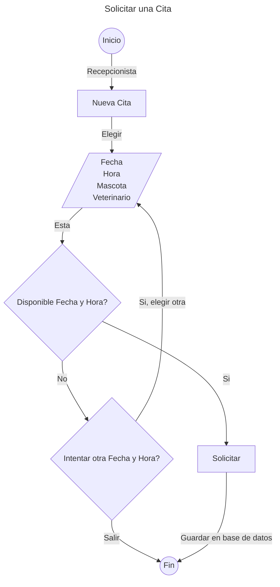
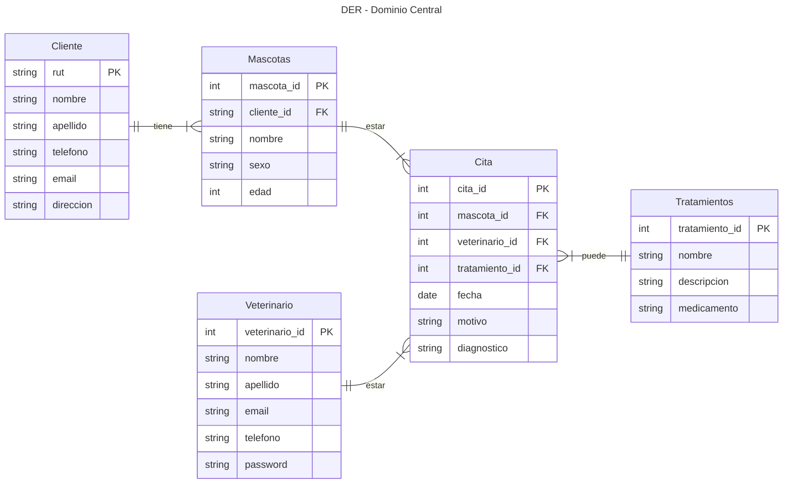

# Fase 3 — Arquitectura y Modelado (Diagramas UML & Flujos)

**Proyecto**: Sistema Veterinario

**Tamaño del proyecto**: [ ] Chico &nbsp; [x] Mediano &nbsp; [ ] Grande

---

## 1. Diagrama de Flujo / Proceso

¿Cómo viaja la información desde el origen hasta el destino?



---

## 2. Modelo de Datos / DER

### 2.1 Diagrama Entidad-Relación



> Nota: Autenticacion (usuarios/roles) y catalogos (especie/raza/estados) - se modelan en la Fase 5.

### 2.2 Tablas

#### Tabla: Clientes

- **Descripción**: Se registraran a los clientes antiguos y nuevo de la veterinaria.
- **Llave Primaria (PK)**: `rut`.

| Columna   | Tipo de dato | Nulo | PK/FK | Descripción                                   |
| --------- | ------------ | ---- | ----- | --------------------------------------------- |
| rut       | [string]     | [No] | [PK]  | Identificador oficial de una persona chilena. |
| nombres   | [string]     | [No] |       | Nombre del cliente.                           |
| apellidos | [string]     | [No] |       | Apellido del cliente.                         |
| telefono  | [string]     | [No] |       |                                               |
| email     | [string]     | [Si] |       |                                               |
| direccion | [string]     | [Si] |       |                                               |

**Relaciones**: [Ninguna]

#### Tabla: Mascotas

- **Descripción**: Se registran las mascotas de cada cliente.
- **Llave Primaria (PK)**: `mascota_id`.

| Columna    | Tipo de dato | Nulo | PK/FK | Descripción |
| ---------- | ------------ | ---- | ----- | ----------- |
| mascota_id | [int]        | [No] | [PK]  |             |
| cliente_id | [string]     | [No] | [FK]  |             |
| nombre     | [string]     | [No] |       |             |
| sexo       | [string]     | [No] |       |             |
| edad       | [int]        | [No] |       |             |

**Relaciones**:

- `cliente_id` es FK que referencia la tabla `clientes`.

#### Tabla: Veterinario

- **Descripción**: Se registran los trabajadores de tipo "Veterinario".
- **Llave Primaria (PK)**: `veterinario_id`.

| Columna        | Tipo de dato  | Nulo | PK/FK | Descripción |
| -------------- | ------------- | ---- | ----- | ----------- |
| veterinario_id | [int]         | [No] | [PK]  |             |
| nombre         | [string]      | [No] |       |             |
| apellido       | [string]      | [No] |       |             |
| email          | [string]      | [No] |       |             |
| telefono       | [string]      | [No] |       |             |
| password       | [string_hash] | [No] |       |             |

**Relaciones**: [Ninguna]

#### Tabla: Tratamientos

- **Descripción**: Tabla catalogo donde se indican todos los posibles tratamiento aplicables a mascotas en la veterinaria.
- **Llave Primaria (PK)**: `tratamiento_id`.

| Columna        | Tipo de dato | Nulo | PK/FK | Descripción |
| -------------- | ------------ | ---- | ----- | ----------- |
| tratamiento_id | [int]        | [No] | [PK]  |             |
| nombre         | [string]     | [No] |       |             |
| descripcion    | [string]     | [Si] |       |             |
| medicamento    | [string]     | [Si] |       |             |

**Relaciones**: [Ninguno]

#### Tabla: Citas

- **Descripción**: Se registran todas las citas de la veterinaria.
- **Llave Primaria (PK)**: `cita_id`.

| Columna        | Tipo de dato | Nulo | PK/FK | Descripción |
| -------------- | ------------ | ---- | ----- | ----------- |
| cita_id        | [int]        | [No] | [PK]  |             |
| mascota_id     | [int]        | [No] | [FK]  |             |
| veterinario_id | [int]        | [No] | [FK]  |             |
| tratamiento_id | [int]        | [Si] | [FK]  |             |
| fecha          | [date]       | [No] |       |             |
| motivo         | [string]     | [Si] |       |             |
| diagnostico    | [string]     | [Si] |       |             |

**Relaciones**:

- `mascota_id` es FK que referencia a la tabla `mascotas`.
- `veterinario_id` es FK que referencia a la tabla `veterinario`.
- `tratamiento_id` es FK que referencia a la tabla `tratamientos`.

---

## 3. Casos de Uso

| Actor         | Caso de uso                          | Descripción breve                             |
| ------------- | ------------------------------------ | --------------------------------------------- |
| Recepcionista | Gestionar clientes y mascotas        | Registrar y actualizar clientes/mascotas      |
| Recepcionista | Agendar citas                        | Crear cita verificando disponibilidad         |
| Recepcionista | Confirmar citas                      | Doble confirmación/cancelación                |
| Veterinario   | Ver historial clínico                | Consultar citas + tratamientos de una mascota |
| Veterinario   | Registrar tratamiento                | Asignar el tratamiento a la cita              |
| Veterinario   | Atender cita y registrar diagnostico | Ver citas asignadas y registrar diagnósticos  |
| Administrador | Gestionar tratamientos               | CRUD del catalogo de tratamientos             |
| Administrador | Gestionar citas                      | Crea/edita/confirma/cancela citas             |
| Administrador | Gestionar clientes y mascotas        | Crea/edita/elimina clientes y sus mascotas    |
| Administrador | Gestionar usuarios y roles           | Crea/edita/elimina usuarios y asignar roles   |
| Administrador | Exportar reportes                    | Genera PDF/Excel de las tablas                |

---

## 4. Módulos / Librerías necesarias

¿Qué módulos o librerías independientes necesito para armar esta solución?

- SweetAlert2 — Encargado de mostrar las alerta.
- (QuestPDF o IronPDF) — Encargado de exportar a PDF.
- ClosedXML — Encargado de exportar a Excel.

---

## 5. Dónde y cómo se almacena la información

Al tener entidades que se relacionan unas con otras, se usara una base de datos relacional, usaremos el motor de SQL Server.

---

## 6. Decisiones de Arquitectura

### 6.1 Fuente de verdad de la DB

- Migraciones EF - única fuente de verdad.
- Los _seed data_ se mueven a `HasData` en las migraciones.
- _Connection string_ nunca _hardcoded_: usar variables de entorno.

### 6.2 Capas de aplicación

- MVC + ViewModels: ViewModels para vistas/validación, entidades EF solo para datos.
- Services: Solo si aparece la lógica repetida.

### 6.3 Estructura de carpetas

```
sistema-veterinario/
├── src/
│   └── SistemaVeterinario.Web/
│       ├── Controllers/
│       ├── Models/                  # entidades EF Core
│       ├── ViewModels/
│       ├── Views/
│       │   └── {Controlador}/       # una carpeta por controlador
│       ├── Helpers/                 # lógica reutilizable
│       ├── Migrations/              # única fuente de verdad del esquema
│       ├── Properties/
│       │   └── launchSettings.json
│       ├── wwwroot/                 # estáticos: css, js, lib (SweetAlert2)
│       ├── Program.cs
│       ├── appsettings.json         # sin connection string hardcodeada
│       ├── SistemaVeterinario.Web.csproj
│       └── Dockerfile
├── tests/
│   └── SistemaVeterinario.Tests/
├── docs/
│   ├── 01-discovery.md
│   ├── 02-requirements-specification.md
│   └── 03-architecture.md
├── docker-compose.yml
├── .env.example
├── SistemaVeterinario.sln
├── .gitignore
├── AGENTS.md
├── README.md
└── tasks.md
```

---

## Checklist de cierre de Fase 3

- [x] Diagrama de flujo principal hecho
- [x] DER y tablas documentadas
- [x] Casos de uso cubiertos
- [x] Librerías/módulos clave identificados
